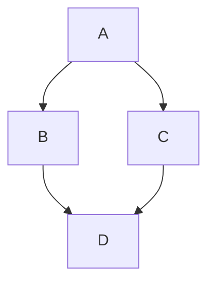

# Section Heading

Some body text of this section.

<a name="my-custom-anchor-point"></a>
Some text I want to provide a direct link to, but which doesn't have its own heading.

(… more content…)

[A link to that custom anchor](#my-custom-anchor-point)

This example  
will span two lines

Also, this example\
will span two lines

This example<br/>
will span two lines


- George Washington
- John Adams
- Thomas Jefferson

1. James Madison
2. James Monroe
3. John Quincy Adams

-----------------------------------------------------------------
1. First list item
   - First nested list item
     - Second nested list item

## Task List

- [x] #739
- [ ] https://github.com/octo-org/octo-repo/issues/740
- [ ] Add delight to the expericence when all tasks are complete :tada:

@github/support What do you think about these updates?

# 1   

Using emojis\
@octocat :+1: This PR looks great - it's ready to merge! :shipit

## Foot Note
Here is a simple footnote[^1].

A footnote can also have multiple lines[^2].

[^1]: My reference.
[^2]: To add line breaks within a footnote, add 2 spaces to the end of a line.  
This is a second line.

## Alerts/Callouts/Admonitions
> [!NOTE]
> Useful information that users should know, even when skimming content.

> [!TIP]
> Helpful advice for doing things better or more easily.

> [!IMPORTANT]
> Key information users need to know to achieve their goal.

> [!WARNING]
> Urgent info that needs immediate user attention to avoid problems.

> [!CAUTION]
> Advises about risks or negative outcomes of certain actions.

Hiding content with comments

<!-- This content will not appear in the rendered markdown -->

## Ignoring Markdown Formating
Let's remae \*our-new-project\* to \*out-old-project\*

##  Disabling Markdown Rendering

## Creating a Table

|First Header|Second Header|
|---|---|
| Cell content|Cell Content|

--------------------------------------------------------------------------------------------------------------------
|Command|Description|
|---|---|
|git status|List all new or modified files|
|git diff|Show file difference that haven't been staged|

-------------------------------------------------------------------------------------------------------------------

|Left Aligned|Center Aligned|Right Alighed|
|:---|:---:|---:|
|git status|git status|git status|
|git diff|git diff|git diff|

--------------------------------------------------------------------------------------------------------------------
|Name|Character|
|---|---|
Backtick|`|
Pipe| \||

## Collapsed Section
--------------------------------------------------------------------------------------------------
<details>

<summary>Tips for collapsed sections</summary>

### You can add a header

You can add text within a collapsed section.

You can add an image or a code block, too.

```ruby
   puts "Hello World"
```

</details>

------------------------------------------------------------------------------------------------

<details open>
   
   ### You can add a header

   You can add text within a collapsed section.

   You can add an image or a code block, too.

   ```ruby
      puts "Hello World"
   ```
</details>   

```
   function text() {
      console.log("notice the blank line before this function?")
}
```

## Syntax Highlighting

```ruby
require 'redcarpet'
markdown = Redcarpet.new("Hello World!")
puts markdown.to_html
```

Here is a simple flow chart:



```mermaid
  info
```

---------------------------------------------------------------------------------------------

```geojson
{
  "type": "FeatureCollection",
  "features": [
    {
      "type": "Feature",
      "id": 1,
      "properties": {
        "ID": 0
      },
      "geometry": {
        "type": "Polygon",
        "coordinates": [
          [
              [-90,35],
              [-90,30],
              [-85,30],
              [-85,35],
              [-90,35]
          ]
        ]
      }
    }
  ]
}
```

```topojson
{
  "type": "Topology",
  "transform": {
    "scale": [0.0005000500050005, 0.00010001000100010001],
    "translate": [100, 0]
  },
  "objects": {
    "example": {
      "type": "GeometryCollection",
      "geometries": [
        {
          "type": "Point",
          "properties": {"prop0": "value0"},
          "coordinates": [4000, 5000]
        },
        {
          "type": "LineString",
          "properties": {"prop0": "value0", "prop1": 0},
          "arcs": [0]
        },
        {
          "type": "Polygon",
          "properties": {"prop0": "value0",
            "prop1": {"this": "that"}
          },
          "arcs": [[1]]
        }
      ]
    }
  },
  "arcs": [[[4000, 0], [1999, 9999], [2000, -9999], [2000, 9999]],[[0, 0], [0, 9999], [2000, 0], [0, -9999], [-2000, 0]]]
}
```

```stl
solid cube_corner
  facet normal 0.0 -1.0 0.0
    outer loop
      vertex 0.0 0.0 0.0
      vertex 1.0 0.0 0.0
      vertex 0.0 0.0 1.0
    endloop
  endfacet
  facet normal 0.0 0.0 -1.0
    outer loop
      vertex 0.0 0.0 0.0
      vertex 0.0 1.0 0.0
      vertex 1.0 0.0 0.0
    endloop
  endfacet
  facet normal -1.0 0.0 0.0
    outer loop
      vertex 0.0 0.0 0.0
      vertex 0.0 0.0 1.0
      vertex 0.0 1.0 0.0
    endloop
  endfacet
  facet normal 0.577 0.577 0.577
    outer loop
      vertex 1.0 0.0 0.0
      vertex 0.0 1.0 0.0
      vertex 0.0 0.0 1.0
    endloop
  endfacet
endsolid
```


